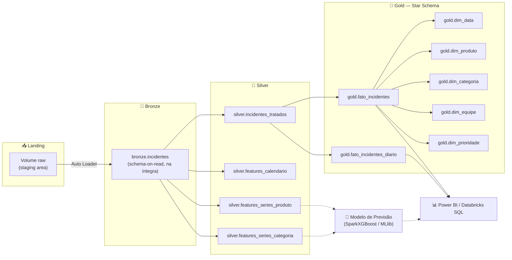

<div align="center">

# AntecipeAI

### Inteligência preditiva de incidentes de TI para a Locaweb

**Enterprise Challenge FIAP × Locaweb** — Turma 2TSCOA, Ciência de Dados

[](https://www.databricks.com/)
[](https://spark.apache.org/)
[](https://delta.io/)
[](https://www.python.org/)
[](https://xgboost.readthedocs.io/)
[](https://powerbi.microsoft.com/)
[](https://www.databricks.com/product/unity-catalog)
[](.github/workflows/ci.yml)
[](LICENSE)

</div>

---

## 🎯 O problema que resolvemos

A **Locaweb** opera uma infraestrutura de TI de larga escala e trata dezenas de milhares de incidentes técnicos por mês (ITSM). Hoje, esse volume é analisado majoritariamente de forma **reativa**: as equipes de NOC/SRE descobrem um pico de incidentes ou um risco de estouro de SLA depois que ele já está acontecendo.

O desafio proposto pela Locaweb no Enterprise Challenge foi transformar esse histórico operacional em **inteligência preditiva**, respondendo perguntas como:

- Quantos incidentes devemos esperar **amanhã (D+1)** e **na próxima semana (D+7)**?
- Quais produtos, categorias ou equipes concentram o risco de descumprir o **OLA**?
- Como identificar tendências de prioridades críticas (**P2/P3**) antes que virem um problema operacional?

O **AntecipeAI** é a resposta a isso: um pipeline de dados de ponta a ponta — da ingestão bruta ao datamart analítico — desenhado para alimentar modelos de previsão de volume de incidentes e dashboards executivos de risco operacional.

## ✨ Principais características

- **Arquitetura Lakehouse Medallion** (landing → bronze → silver → gold) 100% sobre Delta Lake e Unity Catalog.
- **Ingestão incremental** via Databricks Auto Loader, com schema evolution automático.
- **Configuração cloud-agnostic**: um único arquivo `.env` decide se as tabelas são `MANAGED` (Databricks Free, storage do metastore) ou `EXTERNAL` (apontando para S3, ADLS, GCS ou OCI Object Storage) — migrar de ambiente acadêmico para produção não exige reescrever notebook nenhum.
- **Múltiplas tabelas de features na Silver**, desacopladas da base tratada — permite treinar modelos com recortes diferentes (produto, categoria, e extensível a outros) sem duplicar lógica de limpeza.
- **Star Schema na Gold**, pronto para consumo direto via Power BI (DirectQuery) ou Databricks SQL.
- **Toda decisão de modelagem escolhida por compatibilidade real com processamento distribuído** — nada de bibliotecas single-node escondidas atrás de um cluster (veja a seção [Modelos de ML](#-modelos-de-ml)).
- **CI leve no GitHub Actions**: valida sintaxe dos notebooks, lint, integridade da configuração e checagem básica de segredos em cada push/PR.

## 🏗️ Arquitetura



O pipeline roda inteiramente sobre **Databricks Free Edition** (compute serverless), sem custo de infraestrutura para a fase acadêmica — e a mesma base de código é o que será promovida para produção (AWS/Azure/GCP/OCI) se o projeto for aprovado pela Locaweb, trocando apenas variáveis de configuração.

## 🧠 Modelos de ML

**Status: arquitetura definida, treino em desenvolvimento.**

A decisão de modelagem partiu de um critério não negociável: **tudo precisa rodar nativamente em cluster Spark**, sem gargalos de single-node escondidos atrás de uma API distribuída.

| Alternativa considerada | Por que foi descartada |
|---|---|
| Prophet (um modelo por série/segmento) | Treina via Stan, single-node — não distribui nativamente em Spark |
| SHAP puro | Cálculo roda no driver/amostra — não é nativamente distribuído |

| Abordagem adotada | Detalhes |
|---|---|
| **Forecasting como regressão supervisionada** | Em vez de um modelo por segmento, features de calendário + lags (1d/7d/14d) + médias móveis viram entrada de um único modelo multi-segmento (produto/categoria como feature categórica) |
| **SparkXGBoost** (`xgboost.spark.SparkXGBRegressor`) | Treino nativamente distribuído entre os executors do cluster |
| **MLlib** (`GBTRegressor` / `RandomForestRegressor`) | Alternativa 100% nativa do Spark, sem dependência externa |
| **Explicabilidade via `featureImportances` (MLlib)** | Explicabilidade global nativa, sem custo computacional extra e sem sair do paradigma distribuído |
| **SynapseML (LightGBM + SHAP distribuído)** — opcional, futuro | Caminho Spark-nativo se for necessária explicabilidade local por previsão, mantendo compatibilidade de cluster |

## 🔍 Principais descobertas da análise exploratória

A EDA (notebook [`04_exploratory_analysis`](notebooks/04_exploratory_analysis.ipynb)) não foi só checagem de nulos — ela mudou decisões reais de arquitetura:

- **Mudança de regime no volume de incidentes**: o volume bruto salta ~6x em setembro/2025, mas isso é inteiramente causado por uma ferramenta de monitoramento automatizado (tickets auto-fechados, sem intervenção humana), não por variação operacional real. O volume que **entra no KPI** — o que de fato importa para o desafio — é estável desde janeiro/2025. Essa descoberta definiu qual série o modelo deve prever.
- **151 incidentes elegíveis para o KPI mas marcados como fora dele**, concentrados em dezembro/2025 — inconsistência real da fonte, documentada e tratada como flag, não corrigida "por baixo dos panos".
- **2.499 incidentes com duração 10x acima do SLA da própria prioridade**, sem sinalização de violação — tratados como outliers via flag (`duracao_suspeita`), não excluídos.
- Nulos de ~63% em Produto/Categoria são **estruturais** (tickets abertos por monitoramento automatizado), não erro de qualidade — decisão de manter nulo explícito em vez de imputar.

## 📂 Estrutura do repositório

```
.
├── .github/workflows/ci.yml          # CI (lint/validação) + CD (deploy do bundle)
├── databricks.yml                    # Databricks Asset Bundle (config principal)
├── resources/
│   └── antecipeai_job.yml            # Definição do Job (pipeline ETL encadeado)
├── config/
│   └── antecipeai.env                # Configuração central (catalog, schemas, MANAGED/EXTERNAL)
├── notebooks/
│   ├── 00_config.ipynb               # Carrega o .env — importado via %run pelos demais
│   ├── 01_setup_catalog_schemas.ipynb   # Cria catalog, schemas e Volume de staging
│   ├── 02_bootstrap_landing_convert_xlsx.ipynb
│   ├── 03_bronze_ingestion_autoloader.ipynb
│   ├── 04_exploratory_analysis.ipynb    # EDA completa, evidência das decisões de arquitetura
│   ├── 05_silver_transform.ipynb        # Limpeza, regras de negócio, features de série temporal
│   └── 06_gold_datamart.ipynb           # Star Schema (dimensões + fato)
├── LICENSE
└── README.md
```

## ⚙️ Configuração multi-cloud

Toda a portabilidade do projeto está centralizada em [`config/antecipeai.env`](config/antecipeai.env):

```env
ANTECIPEAI_TABLE_TYPE=MANAGED     # MANAGED (Databricks Free) | EXTERNAL (produção em nuvem)
ANTECIPEAI_STORAGE_ROOT=          # s3://..., abfss://..., gs://..., oci://... (só se EXTERNAL)
ANTECIPEAI_CLOUD_PROVIDER=NONE    # NONE | AWS | AZURE | GCP | OCI
```

Migrar da fase acadêmica (Databricks Free, tudo `MANAGED`) para produção é uma troca de valores nesse arquivo — os notebooks não mudam uma linha.

## 🚀 Como rodar

1. Suba a pasta do projeto (com `config/` e `notebooks/` lado a lado) para um Repo do Databricks.
2. Execute os notebooks em ordem:
   `01_setup_catalog_schemas` → `02_bootstrap_landing_convert_xlsx` → `03_bronze_ingestion_autoloader` → `04_exploratory_analysis` → `05_silver_transform` → `06_gold_datamart`.
3. `00_config` não roda sozinho — é chamado via `%run ./00_config` no início de cada notebook.

## 🧪 CI/CD

O workflow [`.github/workflows/ci.yml`](.github/workflows/ci.yml) tem dois jobs encadeados:

**CI — `lint-and-validate`** (roda em todo push/PR para `main`/`develop`):
- ✅ Compila todos os notebooks (`.ipynb`) e valida a sintaxe de cada célula de código para pegar erro de sintaxe antes do deploy.
- ✅ Lint com `flake8` (com exceções deliberadas para `spark`/`dbutils`/`display`, injetados pelo runtime do Databricks e inexistentes no ambiente de CI).
- ✅ Valida que `config/*.env` tem todas as chaves obrigatórias.
- ✅ Checagem básica de segredos hardcoded antes do merge.

**CD — `deploy`** (só em push direto na `main`, só se o CI passar):
- 🚀 Publica o [Databricks Asset Bundle](databricks.yml) no workspace via `databricks bundle deploy --target prod`.
- O bundle sincroniza `notebooks/` + `config/` para o workspace e publica o Job `AntecipeAI - Pipeline ETL` (definido em [`resources/antecipeai_job.yml`](resources/antecipeai_job.yml)), que encadeia as 6 etapas do pipeline como tasks sequenciais.
- Exige os secrets `DATABRICKS_HOST` e `DATABRICKS_TOKEN` configurados no repositório (Settings → Secrets and variables → Actions) — sem eles, só o CI roda, o job de deploy falha isoladamente sem afetar a validação.
- O path de publicação no workspace **não é fixo no código** — o bundle resolve automaticamente a partir de quem está autenticado (`${workspace.current_user.userName}`), então não é preciso descobrir o path do workspace de ninguém de antemão.

Para rodar o deploy manualmente do seu próprio computador (sem depender do GitHub Actions):

```bash
databricks bundle validate   # confere a sintaxe do bundle
databricks bundle deploy --target dev
```

## ⚠️ Desafios técnicos enfrentados

Documentar isso é proposital — decisões de engenharia real raramente são lineares:

- **Auto Loader não lê `.xlsx` nativamente** (só CSV, JSON, Parquet, Avro, ORC, text, binaryFile). A extração atual da Locaweb vem em Excel, o que exigiu decidir entre uma conversão prévia (rejeitada, por reintroduzir processamento single-node) e o uso do conector `spark-excel`.
- **`spark-excel` exige biblioteca Maven no cluster** — e o **Databricks Free Edition oferece apenas compute serverless**, que não suporta instalação de bibliotecas Maven/JAR (confirmado na documentação oficial e em relatos da comunidade Databricks, inclusive tentativas via REST API). Esse é um ponto em aberto do projeto: a solução definitiva depende de qual tier de workspace estará disponível na fase de produção.
- **Parser CSV padrão quebrando em campos de texto livre**: o campo `Descrição resumida` tem quebras de linha e aspas internas que inflavam a contagem de linhas se `multiLine`/`quote`/`escape` não fossem configurados explicitamente — encontrado e corrigido durante os testes locais do pipeline.

## 🗺️ Roadmap

- [x] Ingestão Bronze com Auto Loader e metadata de rastreabilidade
- [x] Camada Silver com regras de negócio validadas e flags de qualidade de dados
- [x] Datamart Gold em Star Schema
- [x] CI básico no GitHub Actions
- [x] CD via Databricks Asset Bundles (deploy automático na `main`)
- [ ] Configurar secrets `DATABRICKS_HOST`/`DATABRICKS_TOKEN` no repositório para o CD publicar de verdade
- [ ] Resolver ingestão do `.xlsx` compatível com cluster (spark-excel em ambiente com suporte a bibliotecas Maven)
- [ ] Notebook de treino do modelo de previsão (SparkXGBoost / MLlib GBTRegressor)
- [ ] Avaliação de modelo (MAE/RMSE por segmento) e registro de experimentos (MLflow)
- [ ] Dashboard Power BI consumindo `gold.fato_incidentes_diario` via DirectQuery
- [ ] Explicabilidade distribuída (SynapseML + LightGBM), se necessária

## 🤝 Contribuindo

Projeto acadêmico do Enterprise Challenge FIAP × Locaweb. Para contribuir, faça um fork e abra um Pull Request — os contribuidores aparecem automaticamente no grafo de contribuições do GitHub.

## 📄 Licença

Distribuído sob a licença [Apache 2.0](LICENSE).

## 🏫 Contexto acadêmico

Projeto desenvolvido para o **Enterprise Challenge** da FIAP, desafio proposto pela **Locaweb**, turma 2TSCOA de Ciência de Dados.