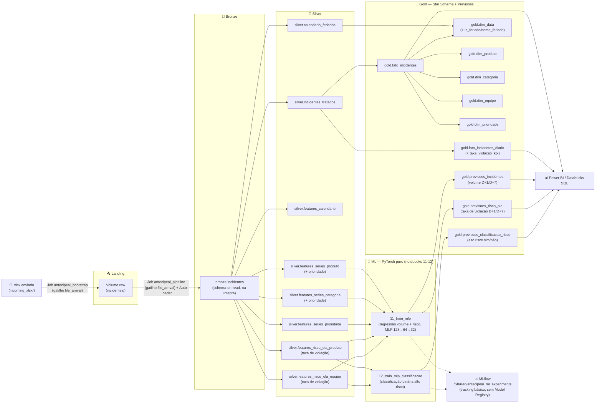

<div align="center">

# AntecipeAI

### Inteligência preditiva de incidentes de TI para a Locaweb

**Enterprise Challenge FIAP × Locaweb** — Turma 2TSCOA, Ciência de Dados

[](https://www.databricks.com/)
[](https://spark.apache.org/)
[](https://delta.io/)
[](https://www.python.org/)
[](https://pytorch.org/)
[](https://powerbi.microsoft.com/)
[](https://www.databricks.com/product/unity-catalog)
[](.github/workflows/ci.yml)
[](LICENSE)

</div>

---

## 🎯 O problema que resolvemos

A **Locaweb** opera uma infraestrutura de TI de larga escala e trata dezenas de milhares de incidentes técnicos por mês (ITSM). Hoje, esse volume é analisado majoritariamente de forma **reativa**: as equipes de NOC/SRE descobrem um pico de incidentes ou um risco de estouro de SLA depois que ele já está acontecendo.

O desafio proposto pela Locaweb no Enterprise Challenge foi transformar esse histórico operacional em **inteligência preditiva**, respondendo perguntas como:

- Quantos incidentes devemos esperar **amanhã (D+1)** e **na próxima semana (D+7)**?
- Quais produtos, categorias ou equipes concentram o risco de descumprir o **OLA**?
- Um segmento vai entrar em **estado de alto risco** de violação nos próximos dias?
- Como identificar tendências de prioridades críticas (**P2/P3**) antes que virem um problema operacional?

O **AntecipeAI** é a resposta a isso: um pipeline de dados de ponta a ponta — da ingestão bruta ao datamart analítico, com modelos de Machine Learning treinados e avaliados contra baseline — desenhado para alimentar dashboards executivos de previsão de volume e risco operacional.

## ✨ Principais características

- **Arquitetura Lakehouse Medallion** (landing → bronze → silver → gold) 100% sobre Delta Lake e Unity Catalog.
- **Ingestão incremental** via Databricks Auto Loader, com schema evolution automático.
- **Configuração cloud-agnostic**: um único arquivo `.env` decide se as tabelas são `MANAGED` (Databricks Free, storage do metastore) ou `EXTERNAL` (S3, ADLS, GCS, OCI) — migrar de ambiente acadêmico para produção não exige reescrever notebook nenhum.
- **Múltiplas tabelas de features na Silver**, desacopladas da base tratada — permite treinar modelos com recortes diferentes (produto, categoria, prioridade) sem duplicar lógica de limpeza.
- **Star Schema na Gold**, pronto para consumo direto via Power BI (DirectQuery) ou Databricks SQL.
- **Três modelos de ML avaliados contra baseline** (regressão de volume, regressão de risco, classificação binária de alto risco), com **portão automático**: nenhum modelo é promovido a "previsão oficial" sem primeiro vencer uma baseline ingênua na validação.
- **Investigação séria de compatibilidade com cluster**: quatro ferramentas de ML distribuído testadas e documentadas como bloqueadas no compute serverless (ver [Desafios técnicos](#️-desafios-técnicos-enfrentados)) antes de chegar na abordagem final.
- **CI leve no GitHub Actions**: valida sintaxe dos notebooks, lint, integridade da configuração e checagem básica de segredos em cada push/PR.

## 📊 Fontes de dados

| Fonte | Tipo | Descrição | Volume / cobertura | Licença | Onde entra no pipeline |
|---|---|---|---|---|---|
| **`LW-DATASET.xlsx`** | Privada, fornecida pela Locaweb | Extração do sistema ITSM de gestão de incidentes de TI da Locaweb — a base de todo o projeto | 122.543 registros, 19 colunas, período de 02/01/2023 a 31/12/2025 | Uso restrito ao Enterprise Challenge FIAP × Locaweb — não redistribuível | `02_bootstrap_landing_convert_xlsx` → `03_bronze_ingestion_autoloader` |
| **[`holidays`](https://github.com/vacanza/holidays) (PyPI)** | Pública, open-source | Biblioteca Python que calcula programaticamente o calendário de feriados nacionais/federais do Brasil — enriquece a dimensão de calendário com `is_feriado`/`nome_feriado` | 28 feriados nacionais no período 2023-2025 (**limitação:** só federais) | MIT License, mantida pelo time [Vacanza](https://github.com/vacanza/holidays) | `05_silver_transform` (versão fixada: `holidays==0.103`) |

O uso do `holidays` como fonte de enriquecimento segue orientação explícita do material da Locaweb para o desafio: *"sinta-se à vontade em incrementar suas análises utilizando outras fontes, desde que sejam públicas e fidedignas"*.

**Nota sobre "item de configuração"**: a Locaweb pede tendência agrupada "por categoria, produto **ou** item de configuração" — a palavra é "ou", não "e". `produto`/`categoria`/`prioridade` já atendem a exigência; `item de configuração` (9.171 valores distintos, ~2,8 incidentes/item em 3 anos de histórico) foi deliberadamente deixado de fora por esparsidade extrema, não por esquecimento.

## 🏗️ Arquitetura



O pipeline roda inteiramente sobre **Databricks Free Edition** (compute serverless), sem custo de infraestrutura para a fase acadêmica. A ingestão é **automática**: dois Jobs com gatilho `file_arrival` encadeiam a execução assim que um arquivo novo chega — `antecipeai_bootstrap` (converte `.xlsx` → Parquet) e `antecipeai_pipeline` (Bronze → Silver → Gold → treino dos modelos). Um terceiro Job, `antecipeai_setup`, roda manual e uma única vez (criação de catalog/schemas/Volume).

## 🧠 Modelos de ML

**Status: 3 modelos treinados, avaliados e gravando previsão real em Gold.**

### A jornada até a abordagem final

Testamos, nessa ordem, tudo que o Spark oferece pra ML distribuído — e documentamos cada tentativa, incluindo as que perderam por desempenho e as que foram bloqueadas por ambiente (são motivos diferentes, e os dois importam):

| Tentativa | Resultado |
|---|---|
| `GBTRegressor` (MLlib, 100% nativo Spark) | ⚠️ Rodou sem problema de ambiente — mas **perdeu pra baseline** (média móvel 7d) em 4 de 6 combinações de volume. Não é questão de ambiente, é desempenho fraco mesmo |
| `SparkXGBRegressor` (distribuído) | ❌ Bloqueado — `spark.task.cpus` não disponível no serverless |
| `XGBoost` puro (single-node, `toPandas()`) | ⚠️ Rodou sem problema de ambiente — testado lado a lado com `GBTRegressor` e a baseline em 2 combinações: leve melhora sobre `GBTRegressor`, mas **também perdeu pra baseline nas duas**. Não valia a pena continuar nessa linha, independente do bloqueio da versão distribuída |
| `TorchDistributor` (`local_mode=False`, PyTorch distribuído via barrier execution) | ❌ Bloqueado — `spark.master` não disponível no serverless |
| **MLP puro (PyTorch, `toPandas()` + treino no driver)** | ✅ **Venceu a baseline em 10 de 10 combinações de volume/risco na validação** — abordagem final |

**Fica claro, separando os dois motivos**: `GBTRegressor` e `XGBoost` puro não foram descartados por bloqueio de ambiente — os dois **rodaram normalmente** no serverless (nenhum usa API de cluster que o Databricks Free bloqueia) e **perderam por desempenho puro**, mesmo depois de testados de verdade. Já `SparkXGBRegressor` e `TorchDistributor` (as versões *distribuídas*) nunca chegaram a rodar — foram bloqueadas antes mesmo de dar pra avaliar desempenho (`CONFIG_NOT_AVAILABLE.WITHOUT_SUGGESTION` nos dois casos — detalhe em [Desafios técnicos](#️-desafios-técnicos-enfrentados)). Não misturamos as duas coisas: "perdeu jogando" é diferente de "nem entrou em campo".

**Por que PyTorch puro (sem distribuição) ainda é uma escolha defensável**: as tabelas de feature são pequenas o bastante (a maior tem ~430 mil linhas) para caber inteiras em memória via `toPandas()` — o treino roda no driver, sem paralelismo entre workers, mas isso não é um problema real no volume de dado atual do projeto.

### Arquitetura da rede

`128 → 64 → 32 → 1`, `Dropout(0.2)` nas duas primeiras camadas, `Adam` (`lr=0.002`, `weight_decay=1e-4`), 250 épocas — mesma base para os 3 modelos.

**Função de perda da regressão: `HuberLoss(delta=0.5)`, não `MSELoss`.** `MSE` eleva o erro ao quadrado, deixando dias/segmentos com pico raro dominar o gradiente desproporcionalmente — instável justamente na série mais esparsa (`produto`, `categoria`), que é zero-inflacionada por natureza (ver EDA). `HuberLoss` se comporta como MSE pra erro pequeno mas vira linear pra erro grande, mais robusto a outlier. Testado contra `MSELoss` nas 10 combinações: melhorou ou empatou em todas, e fechou a única combinação que perdia o portão na validação (`features_risco_ola_produto/target_taxa_d1`).

Classificação usa uma arquitetura diferente de saída — ver seção própria abaixo.

### Portão automático vs. baseline (regressão)

Nenhum modelo grava previsão em Gold sem primeiro vencer a baseline (**média móvel 7 dias**) na validação. Resultado real, `11_train_mlp` (10 combinações — 6 de volume, 4 de risco de OLA), com `HuberLoss`:

| Segmentação | D+1 | D+7 |
|---|---|---|
| produto | 🟢 modelo | 🟢 modelo |
| categoria | 🟢 modelo | 🟢 modelo |
| prioridade | 🟢 modelo | 🟢 modelo |

**Modelo vence nas 10 de 10** com `HuberLoss` — inclusive a `categoria/D+1`, que com `MSELoss` só vencia por margem de ruído na validação e não se confirmava no teste; com `Huber`, a vitória ficou sólida nos dois.

### Classificação binária de alto risco — *residual learning*

A primeira versão treinava um classificador binário direto (`BCEWithLogitsLoss` + `pos_weight`) e nunca bateu a baseline — testamos 12 técnicas diferentes tentando reverter isso (Focal Loss, oversampling, arquitetura maior, transfer learning, fine-tuning em duas etapas, stacking, mais granularidade de lag, ensemble por `OU`), nenhuma bateu a baseline de forma robusta.

**O que funcionou: prever o resíduo, não o valor absoluto.** Em vez do modelo prever a taxa de violação do zero, ele prevê **o quanto a realidade vai desviar da baseline** (`taxa_real - taxa_media_movel_7d`) — a previsão final é `baseline + resíduo_previsto`. A baseline vira o ponto de partida embutido no cálculo, não uma feature entre outras que o modelo pode simplesmente ignorar (o que ela vinha fazendo nas 12 tentativas anteriores). Isso deu **recall maior que a baseline nas 4 de 4 combinações**, em validação e teste.

**Por que a métrica de portão é recall, não F1.** Pra risco de violação de SLA, um **falso negativo** (deixar passar um risco real, sem avisar ninguém) custa muito mais pra Locaweb do que um **falso positivo** (a equipe checa um alarme que não se confirma — minutos perdidos, sem dano real). F1 pesa os dois erros igual, o que não reflete essa assimetria de custo do negócio. Recall mede diretamente "de todo risco real que existia, quantos a gente pegou" — é a métrica certa quando perder caso custa mais caro que alarme falso.

**O preço, sem esconder**: o número de falsos positivos sobe bastante (às vezes 4-5x mais que a baseline) — é o trade-off sendo aceito de propósito, documentado, não ignorado.

### 🔍 Achado: classe desbalanceada quebrando o treino direto

Antes de chegar no *residual learning*, o classificador direto aprendia o caminho preguiçoso — prever sempre "não é risco", já que isso acerta ~95% das linhas sem esforço (mais de 90% dos dias/segmentos têm taxa de violação = 0, mesmo achado de zero-inflação da EDA). `pos_weight` sozinho não resolvia isso de forma consistente — só o *residual learning* resolveu de vez, ao mudar o que o modelo aprende, não só como ele é penalizado.

### Limiar de "alto risco"

Calculado como o **percentil 75 da taxa de violação, só no conjunto de treino** (evita vazamento de validação/teste) — adaptativo ao dado de cada segmento, em vez de um número cravado arbitrariamente.

## 🔍 Principais descobertas da análise exploratória

A EDA (notebook [`04_exploratory_analysis`](notebooks/04_exploratory_analysis.ipynb)) não foi só checagem de nulos — mudou decisões reais de arquitetura e de modelagem:

- **Mudança de regime no volume de incidentes**: o volume bruto salta ~6x em setembro/2025, causado por uma ferramenta de monitoramento automatizado, não por variação operacional real. O volume que **entra no KPI** é estável desde janeiro/2025 — por isso o treino de ML usa só o histórico a partir de dezembro/2024 (`DATA_INICIO_TREINO_ML`).
- **Zero-inflação extrema**: ~89% das linhas de teste de `produto`/D+1 têm valor real igual a zero, e mais de 90% dos dias/segmentos de risco nunca violam OLA. Isso quebra o MAPE tradicional (WAPE foi usado como alternativa) e, na classificação, quebrou o treino até corrigirmos com `pos_weight`.
- **151 incidentes elegíveis para o KPI mas marcados como fora dele**, concentrados em dezembro/2025 — inconsistência real da fonte, documentada como flag (`kpi_regra_divergente`), não corrigida "por baixo dos panos".
- **2.499 incidentes com duração 10x acima do SLA da própria prioridade**, sem sinalização de violação — investigamos e encontramos evidência (código de fechamento "Sem retorno do solicitante" em boa parte dos casos) de que pode ser SLA pausado por espera do cliente, não erro da fonte — tratado como outlier via flag (`duracao_suspeita`), não "corrigido" às cegas.

## 📂 Estrutura do repositório

```
.
├── .github/workflows/ci.yml          # CI (lint/validação) + CD (deploy do bundle)
├── databricks.yml                    # Databricks Asset Bundle
├── resources/
│   └── antecipeai_job.yml            # Definição do Job (pipeline ETL encadeado)
├── config/
│   └── antecipeai.env                # Configuração central (catalog, schemas, MANAGED/EXTERNAL)
├── notebooks/
│   ├── 00_config.ipynb               # Carrega o .env — importado via %run pelos demais
│   ├── 01_setup_catalog_schemas.ipynb
│   ├── 02_bootstrap_landing_convert_xlsx.ipynb
│   ├── 03_bronze_ingestion_autoloader.ipynb
│   ├── 04_exploratory_analysis.ipynb
│   ├── 05_silver_transform.ipynb
│   ├── 06_gold_datamart.ipynb
│   ├── 11_train_mlp.ipynb            # Regressão (volume + risco), MLP + portão + grava Gold
│   ├── 12_train_mlp_classificacao.ipynb  # Classificação binária de alto risco + grava Gold
│   └── historico/                    # Notebooks substituídos pela abordagem MLP — mantidos
│       │                              # como evidência da investigação (GBTRegressor era a
│       │                              # abordagem original, superada em desempenho pelo MLP)
│       ├── 07_ml_prep.ipynb
│       ├── 08_train_volume.ipynb
│       ├── 09_inference_gold.ipynb
│       └── 10_train_risco_regressao.ipynb
├── LICENSE
└── README.md
```

## ⚙️ Configuração multi-cloud

Toda a portabilidade do projeto está centralizada em [`config/antecipeai.env`](config/antecipeai.env):

```env
ANTECIPEAI_TABLE_TYPE=MANAGED     # MANAGED (Databricks Free) | EXTERNAL (produção em nuvem)
ANTECIPEAI_STORAGE_ROOT=          # s3://..., abfss://..., gs://..., oci://... (só se EXTERNAL)
ANTECIPEAI_CLOUD_PROVIDER=NONE    # NONE | AWS | AZURE | GCP | OCI
```

## 🚀 Como rodar

1. Suba a pasta do projeto (com `config/` e `notebooks/` lado a lado) para um Repo do Databricks.
2. Execute em ordem:
   `01_setup_catalog_schemas` → `02_bootstrap_landing_convert_xlsx` → `03_bronze_ingestion_autoloader` → `04_exploratory_analysis` → `05_silver_transform` → `06_gold_datamart` → `11_train_mlp` → `12_train_mlp_classificacao`.
3. `00_config` não roda sozinho — é chamado via `%run` pelos demais.
4. Os notebooks em `notebooks/historico/` **não fazem parte do fluxo de produção** — só rode se quiser reproduzir a comparação de modelos (GBTRegressor vs. MLP) por conta própria.

## 🧪 CI/CD

O workflow [`.github/workflows/ci.yml`](.github/workflows/ci.yml) tem dois jobs encadeados:

**CI — `lint-and-validate`** (todo push/PR): compila e valida sintaxe dos notebooks `.ipynb`, lint com `flake8`, valida `config/*.env`, checagem básica de segredos.

**CD — `deploy`** (só push direto na `main`, só se o CI passar): publica o [Databricks Asset Bundle](databricks.yml) via `databricks bundle deploy --target prod`, usando os secrets `DATABRICKS_HOST`/`DATABRICKS_TOKEN` já configurados no repositório.

## ⚠️ Desafios técnicos enfrentados

Documentar isso é proposital — decisões de engenharia real raramente são lineares:

- **Quatro ferramentas de ML distribuído bloqueadas pelo mesmo padrão**: `spark-excel` (biblioteca Maven, requer cluster não-serverless), `spark.conf.set` para Column Mapping (`CONFIG_NOT_AVAILABLE`), `SparkXGBRegressor` (`spark.task.cpus` indisponível), `TorchDistributor` em modo distribuído (`spark.master` indisponível). Confirma que é limitação de arquitetura do compute serverless do Databricks Free Edition, não falha pontual — motivou a decisão final de usar PyTorch puro (`toPandas()` + treino no driver) em vez de insistir em distribuição.
- **`maxBins` do `GBTRegressor` insuficiente para colunas categóricas de alta cardinalidade** — corrigido calculando dinamicamente a partir da cardinalidade real de cada coluna.
- **Bug de coluna duplicada no treino MLP**: a coluna usada como baseline (`media_movel_7d`) também é uma das features de entrada — selecioná-la duas vezes no Spark gerava uma coluna duplicada no Pandas, inflando silenciosamente o número de colunas do tensor de entrada e quebrando o `nn.Linear` (`mat1 and mat2 shapes cannot be multiplied`). Corrigido evitando a seleção duplicada.
- **Classe desbalanceada quebrando o treino de classificação**: ver seção [Modelos de ML](#-modelos-de-ml) — `pos_weight` sozinho não resolveu de forma consistente; a solução real foi mudar a abordagem inteira para *residual learning*.
- **MAPE quebra em série esparsa**: WAPE usado como alternativa mais robusta a zero-inflação.
- **Indexador de categoria "solto" quebrando a inferência** (versão GBTRegressor, arquivada): corrigido nos notebooks históricos unificando tudo em `Pipeline` do Spark ML antes de migrar para a abordagem MLP.

## 🗺️ Roadmap

- ✅ Pipeline ETL completo (Bronze → Silver → Gold, Star Schema)
- ✅ Regressão de volume de incidentes (MLP, D+1/D+7), gravando `gold.previsoes_incidentes`
- ✅ Regressão de risco de OLA (MLP, D+1/D+7), gravando `gold.previsoes_risco_ola`
- ✅ Classificação binária de alto risco (MLP), gravando `gold.previsoes_classificacao_risco`
- ✅ Portão automático vs. baseline em todos os modelos
- ✅ Investigação documentada de 4 tentativas de ML distribuído bloqueadas no serverless
- ✅ CI/CD via GitHub Actions + Databricks Asset Bundles
- ✅ CI/CD via GitHub Actions + Databricks Asset Bundles
- ✅ Dashboard Power BI consumindo as tabelas de previsão via DirectQuery
- ✅ Auto Loader com gatilho automático (file arrival trigger) — 3 Jobs encadeados (`antecipeai_setup` manual, `antecipeai_bootstrap` e `antecipeai_pipeline` com gatilho), dispara sozinho a cada arquivo novo
- ✅ MLflow — tracking básico de experimentos, registrando parâmetro/métrica de cada uma das 14 combinações treinadas (`11`/`12`) em `/Shared/antecipeai_ml_experiments`
- 🚫 Resolver ingestão do `.xlsx` compatível com cluster (`spark-excel`) — **descartado**: a causa raiz é o compute serverless do Free Edition não suportar bibliotecas Maven, e isso só muda com conta paga (cluster clássico). Não é prioridade retomar sem essa mudança de ambiente.
- ⬜ Refinar `duracao_suspeita` (excluir casos de "Sem retorno do solicitante", possível SLA pausado) — **ideia levantada, nunca implementada/testada**; ficou só como hipótese registrada durante a EDA, não entrou em nenhum notebook
- ⬜ Enriquecer calendário com eventos de varejo (Black Friday, Cyber Monday, Natal)
- ⬜ Testar janela de treino alternativa (set/2024 vs. dez/2024 vs. histórico completo)

## 🤝 Contribuindo

Projeto acadêmico do Enterprise Challenge FIAP × Locaweb. Para contribuir, faça um fork e abra um Pull Request — os contribuidores aparecem automaticamente no grafo de contribuições do GitHub.

## 📄 Licença

Distribuído sob a licença [CC BY-NC 4.0](LICENSE) (Creative Commons Atribuição-NãoComercial) — uso comercial requer autorização explícita dos autores.

## 🏫 Contexto acadêmico

Projeto desenvolvido para o **Enterprise Challenge** da FIAP, desafio proposto pela **Locaweb**, turma 2TSCOA de Ciência de Dados.
